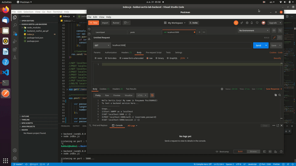
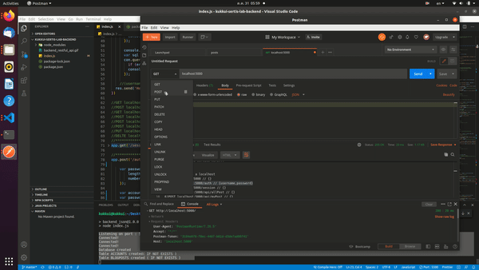
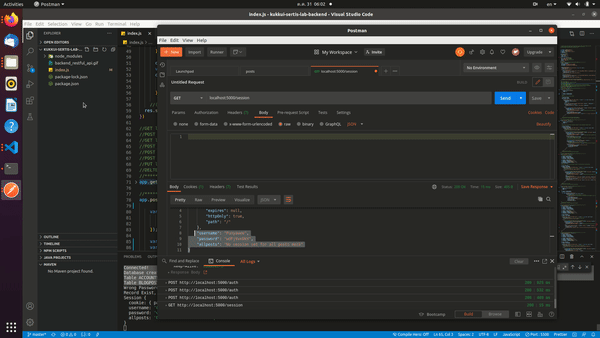
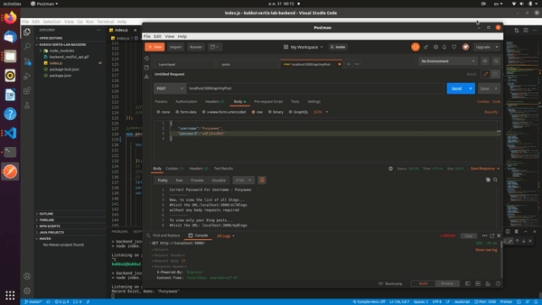
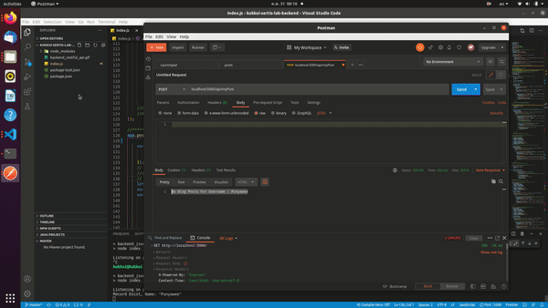
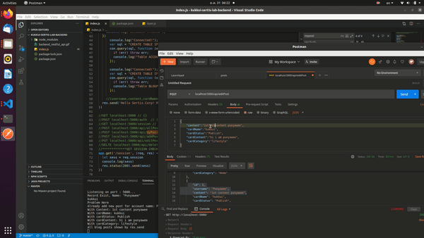
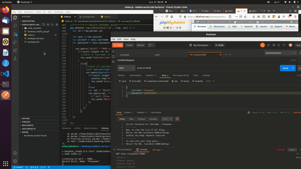

<b>SERTIS BACKEND LAB</b>
  
**TODOS...**
1. npm i --save 
2. npm start  

| URL | METHOD | REQ-BODY | EVENTS |
| ------ | --- | ------ | ------------ |
| localhost:5000/ | GET | - | Create table/database and set sessions|
| localhost:5000/auth | POST | username password | check for account authentication, old account check password, new account randomly generated password | 
| localhost:5000/posts/all  | GET | - | list all post from anyone with JSON output. Fetch from mysql online instead of local mysql| 
| localhost:5000/posts/me | GET | - | list all posts that own by current authenticated user |
| localhost:5000/posts/new | POST | content cardName cardstatus cardContent cardCategory | Add new post(with title/status/category/name/etc) and record the owner rights | 
| localhost:5000/posts/edit[:id] | PUT | content cardName cardstatus cardContent cardCategory | Update the post that own by the current authenticted user |
| localhost:5000/posts/delete/[:id] | DELETE | - | Delete content own by the authenticated user | 

 

 
 
<b>GET localhost:5000 <= {} </b>  

 
 
<b>POST localhost:5000/auth  <= {username,password} </b>  

 
 
<b>GET localhost:5000/posts/all <= {} </b>  

 
 
<b>GET localhost:5000/posts/me <= {} </b>  

 
 
<b>POST localhost:5000/posts/new <= {content,cardName,cardstatus,cardContent,cardCategory} </b>  

 
 
<b>PUT localhost:5000/posts/edit/[:id] <= {content,cardName,cardstatus,cardContent,cardCategory} </b>  

 
 
<b>DELTE localhost:5000/posts/delete/[:id] <= {} </b>  

 

# kk-sertis-lab-backend-v2
